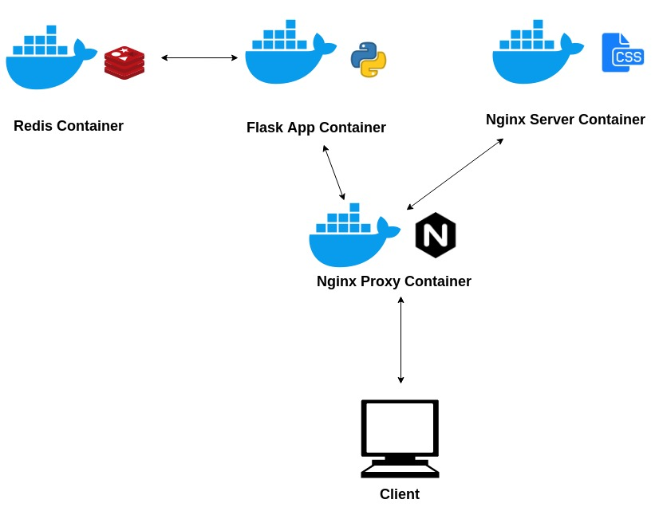

# Intermediate Docker Exercice 5
## Exercise Description
The purpose of the following excercise is to learn how to use docker containers by using Dockerfiles and a docker-compose file to automate the deployment of the services that are part of the application
## How to Start:
* To run this excercise first you need docker and docker-compose installed
* To build all Dockerfiles run the following command:
```bash
$ docker-compose build
```
* To start all services in the docker-compose file just run:
```bash
$ docker-compose up
```
* To stop all services just run:
```bash
$ docker-compose down
```
## Architecture Diagram
The excercice requires four services:
* Redis: to store information
* Flask: Python framework for web applications
* Nginx Server: a server to serve static files (css, js)
* Nginx Proxy: a proxy server used to distribute requests

The following diagram shows how the whole application works:


## Docker Compose File

### database Service
* The service pulls a redis image from dockerhub to create a container running redis
* The container is named as redis-server so the python application can communicate with this container.
* This container is added to a network called ejercicio5.
```yml
database:
    image: redis
    container_name: redis-server
    networks:
      - ejercicio5
```

### app service
* This container is in charge of running the python/flask wep application
* The image used for this container is builded from a Dockerfile that has Python 3 installed and Flask framework.
* This container is linked with the database service, this means that the redis-server needs to be up before app does.
* The container is also added to ejercicio5 network
```yml
app:
    build:
      context: ./Python
    container_name: flask-app
    ports:
      - "8000:8000"
    links:
      - database

    networks:
      - ejercicio5
```
### static service
* This service is in charge of serving all static files
* The container's image definition is described in a Dockerfile that exteds from an nginx image
* It is also added to network ejercicio5
```yml
static:
    build:
      context: ./Nginx
    container_name: static_server
    networks:
      - ejercicio5
    ports:
      - "8001:80"
```

### proxy service
* The proxy service container is in charge of redirecting all requests to the right container
* The container's image definition is described in a Dockerfile that exteds from an nginx image, the nginx container runs a custom configuration to achieve redirection to the right container
* This container is also in the network
```yml
proxy:
    build:
      context: ./Nginx_Proxy
    container_name: proxy_server
    ports:
      - "80:80"
    networks:
      - ejercicio5
    links:
      - static
      - app
```
